# Intelligent-placer-and-checker

## Постановка задачи

Требуется создать “Intelligent Placer”: по поданной на вход фотографии нескольких предметов на светлой горизонтальной поверхности и многоугольнику необходимо понимать, можно ли расположить одновременно все эти предметы на плоскости так, чтобы они поместились в заданный многоугольник

### Подробная описание

* [Intelligent Placer](https://docs.google.com/document/d/1o0lawEvLgmh9VrA5fUlOHFvo5JKxR4NThCFobmrKz60/edit#)
* [Intelligent Checker](https://docs.google.com/document/d/1Tmn7BLnHXiAsdCpB_GQVDqUx3AoGEdfOoTyn3Eg3P7A/edit#heading=h.wh4ex1kspujz)


## Данные
[Ссылка на данные](https://github.com/Nikitagritsaenko/Intelligent-placer-and-checker/tree/develop/intelligent_placer_lib/ML2021Dataset)

Каждая фотография содержит ровно один предмет на фоне белого листа А4.

Требования к этим фотографиям

- На фото только 1 объект
- Предмет и край листа А4 не пересекаются
- Источник света должен быть строго сверху над областью фотографирования
- Фотографировать нужно строго вертикально (перпендикулярно листу бумаги) на расстоянии не менее 50 см от листа бумаги, не допускается наличие проекций предметов // Проекционного искажения предметов
- Рекомендуется фотографировать со вспышкой для избежание наличия ярко выраженный теней на листе бумаги
- Нет размытий, разрешенеи не менее 96 dpi
- Отсутсвие шума на изображении

**Пример фотографий**

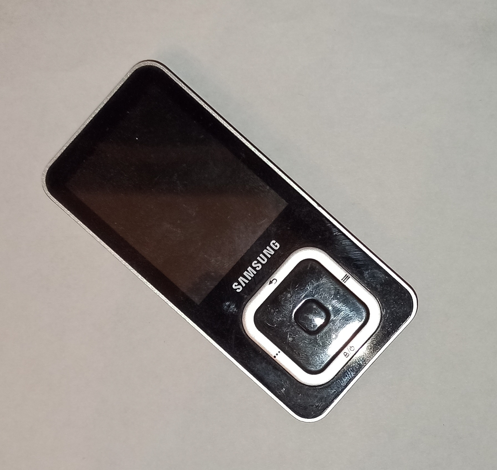 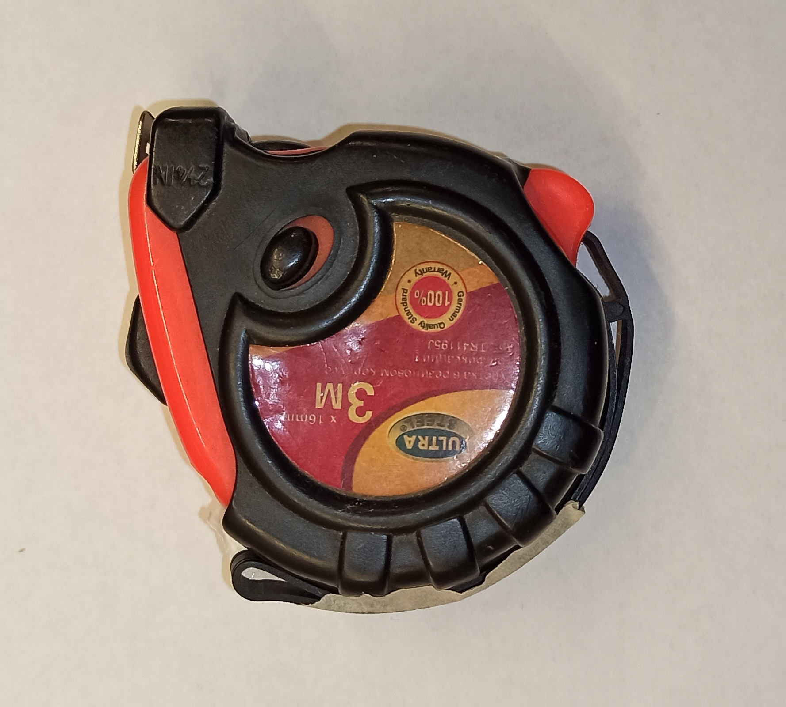 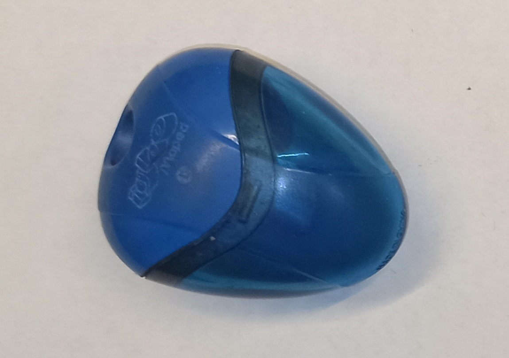


## Входные данные
На вход Plaser\`а подаётся фотография, на которой изображено несколько предметов и многоугольник, заданный набором координат (в миллиметрах) обходом против часовой стрелки.

Требования к фотографиям
- Светлый однотонный фон
- Предметы не пересекаются между собой
- Каждый предмет целиком видно на фото
- На фото есть предметы только из тех, что указаны в датасете для Placer (см. выше)

Требования к многоугольнику
- Точки задаются в порядке обхода против часовой стрелки

**Пример входных фотографий**

[Ссылка на примеры](https://github.com/Nikitagritsaenko/Intelligent-placer-and-checker/tree/develop/PlacerDataset)

 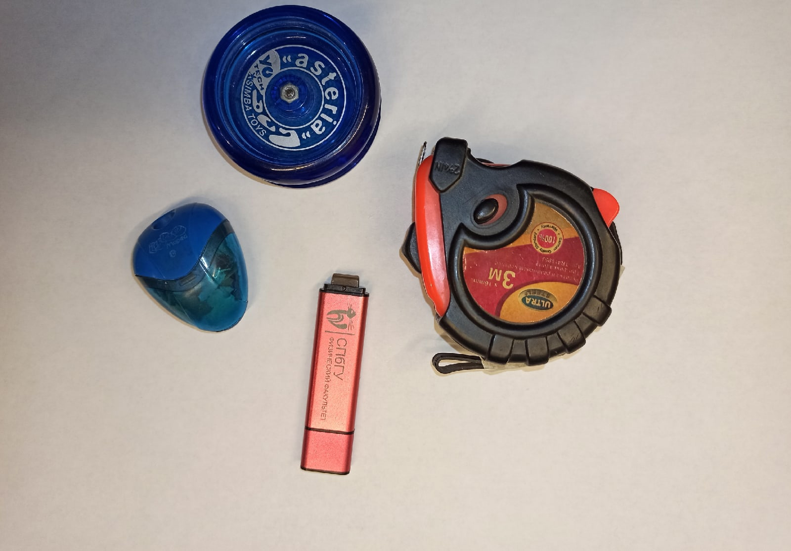 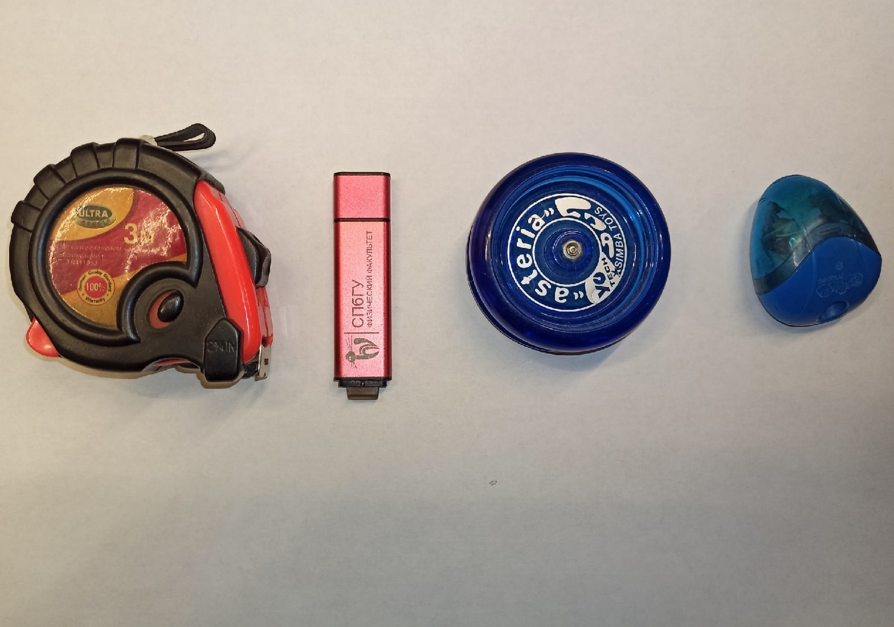


## Результаты работы алгоритма

По результатам обработки фотографии Plaser даёт ответ:
- True - Набор предметов можно разместить в многоугольнике
- False - Plaser\`у не удалось разместить без пересечений предметы внутри многоугольника

Если установлен дополнительный параметр-флаг `verbose`, то при положительном ответе (True) будет выведено изображение, с полученным размещением предметов:

**Примеры размещения**

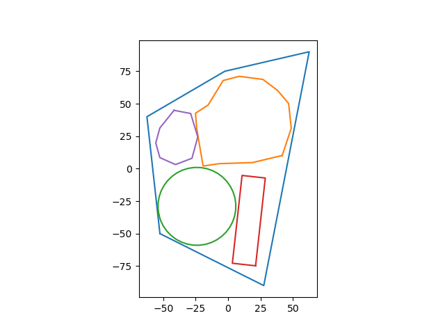 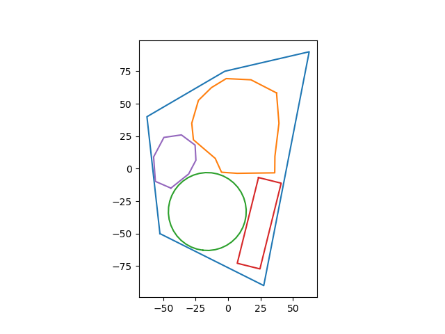 

## Файл настроек для Intelligent Cheker

Настройки параметров для Cheker\`а находятся в файле [default_config.yaml](https://github.com/Nikitagritsaenko/Intelligent-placer-and-checker/blob/develop/intelligent_placer_lib/default_config.yaml)

Файл составлен согласно [этому интерфейсу](https://github.com/PrimatElite/ml-labs)


в файле расположен метод взаимодействия - `check_image`.
```python
def check_image(path, polygon=None, verbose=False)
```
`path` - путь к обрабатываемому изображению 

`polygon` - точки многоугольника, заданные в порядке обхода против часовой стрелки

`verbose` - (def. False) флаг, отвечающий за вывод подробной информации и процессе обработки

return value: (bool) - смог ли Plaser разместить предметы без пересечения внутри многоугольника

### Пример использования
```python
check_image (path="PlacerDataset/1.jpg",
             polygon=[[40, 0], [30, 90], [90, 125], [155, 140], [120, -40]],
             verbose=True)
```


## Описание алгоритма

### Общая идея
Рандомизированный алгоритм с *N* итерациями. Его мы запускаем *N* раз, и, если хотя бы раз алгоритму удалось упаковать предметы внутрь прямоугольника, то тогда возвращаем ответ “да”, иначе - “нет”. 
При этом алгоритм пытается класть предметы в порядке уменьшения их площади.

### Описание итерации алгоритма
Каждая итерация - это попытка положить все предметы в порядке уменьшения их площади внутрь многоугольника.

Кидаем случайную точку внутрь многоугольника. Пусть это центр контура объекта. Пытаемся понять, можно ли положить объект так, что его центр будет в этой точке. Пробуем, например, все положения по 15 градусов. Если не получилось, то для этого объекта берем следующую точку. Так будем пробовать *M* раз максимально. Если не получилось за *M* раз, то выход и ответ “нет”, идем в следующую из *N* попыток. Если получилось, то берем следующий предмет и проверяем для него.

### Оптимизация
Если алгоритм пытается положить предмет на какое-либо место внутри многоугольника, но при этом предмет начинает перекрываться *с одним* уже уложенным предметом, то последний предмет алгоритм пытается передвинуть. На это ему даётся *K* попыток. При этом такая оптимизация применяется только в том случае, если за *M/2* попыток не удалось положить новый предмет.

Если новый предмет пересёкся с большее чем 1 предметом внутри многоугольника, то тогда скорее всего место внутри многоугольника подобрано неудачно. Алгоритм не будет пытаться передвигать существующие предметы.


## Тестирование

Все предметы определяются с небольшим запасом, и упаковка объектов не идеально плотная. Потому, если изначально предметы невозможно расположить в многоугольнике, то, почти наверное, Placer тоже даст ответ False. То есть крайне трудно подобрать пример, для получения ложноположительного ответа.

Потому особый интерес заключается в рассмотрении случаев ложноотрицательных ответов. Для этого зададим 11 примеров, в которых предметы заведомо можно разместить в многоугольнике. Притом зададим многоугольник так, чтобы предметы находились в нём довольно плотно. То есть не будем брать тривиальные случаи, когда в многоугольнике остаётся много места после размещения.
И посмотрим на процент верных ответов.

Решено ограничиться 11 примерами, так как необходимо точно знать правильный ответ. А задача ручного создания «граничных» примеров весьма трудозатратна.

### Результаты
Всего тестов: 11
* Верных ответов: 7 (63.6%)
* Ложных ответов: 4 (36.4%)

Дополнительно рассмотрим ситуацию, когда Placer никогда не ошибается в классификации предметов. То есть ложноотрицательные ответы связаны именно с размещением объектов в многоугольнике.
Для этого сообщим Placer`у набор предметов, находящихся на каждом из примеров и, опустив шаг с классификацией, сразу перейдём к размещению объектов.

Всего тестов: 11
* Верных ответов: 10 (90.9%)
* Ложных ответов: 1 (9.1%)

# Тестовый набор:

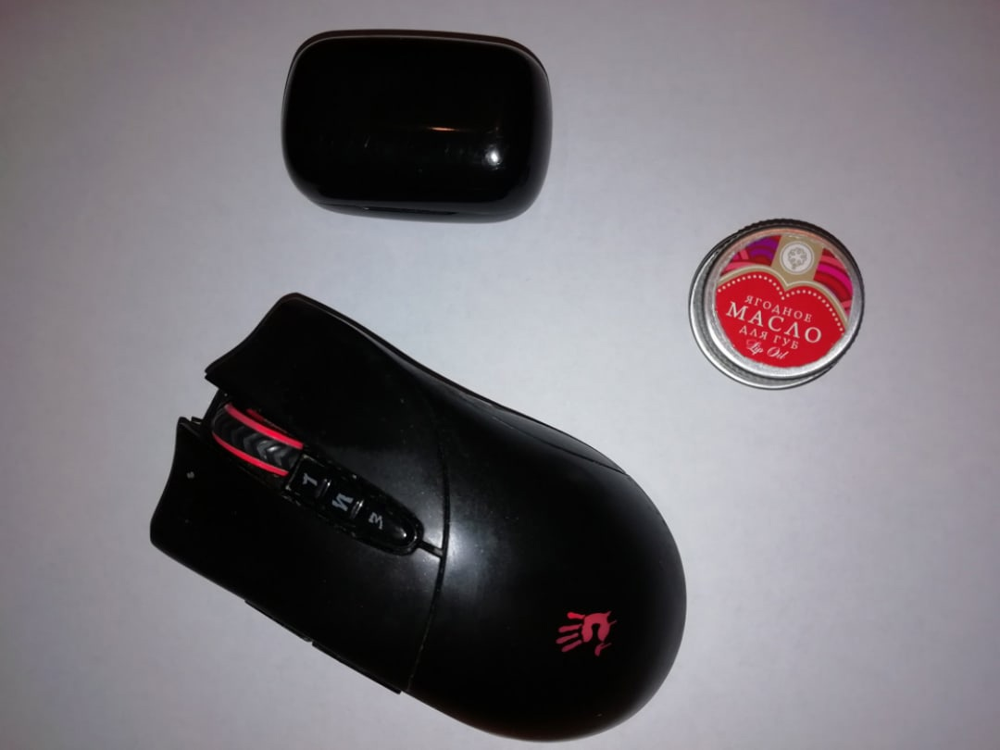 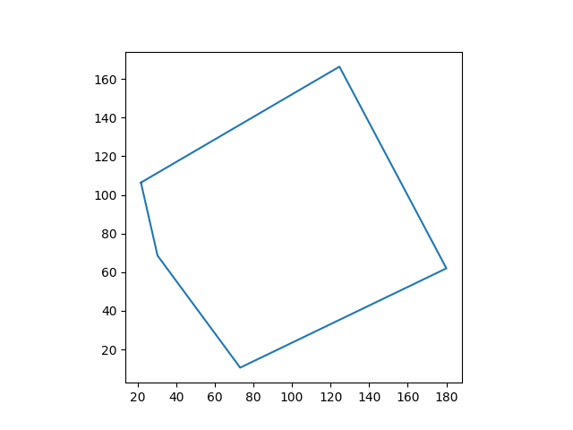 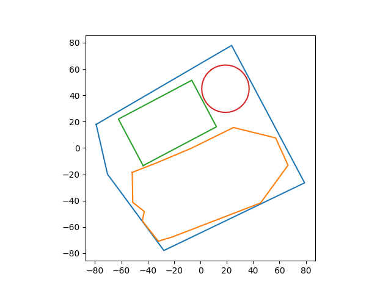 

  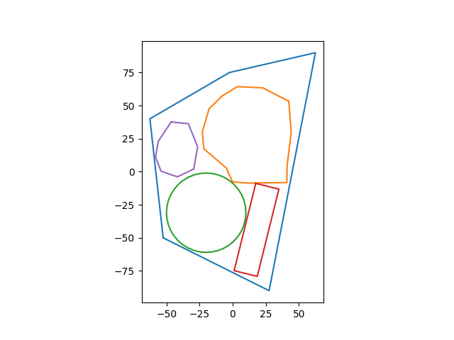 

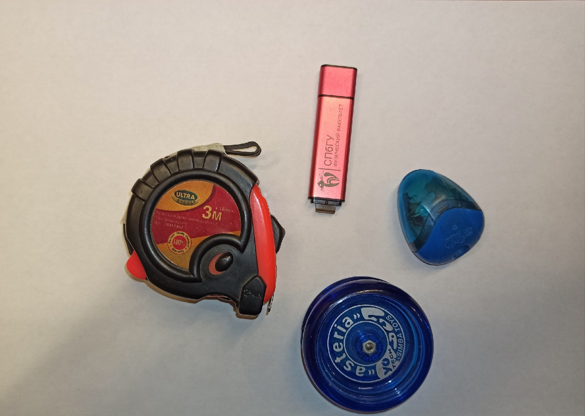 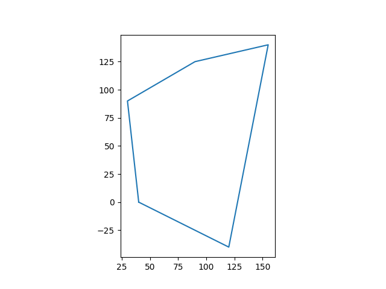 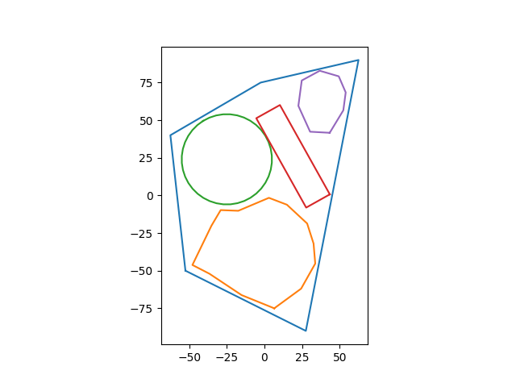 

 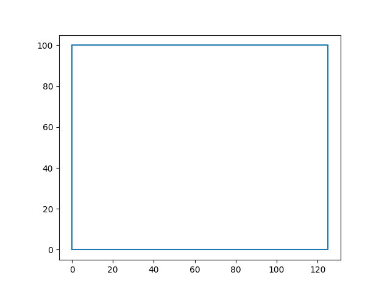 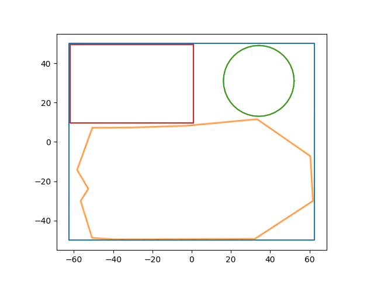 

 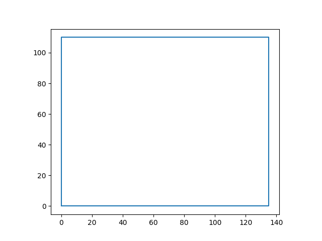 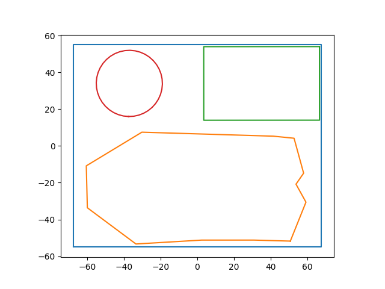 

 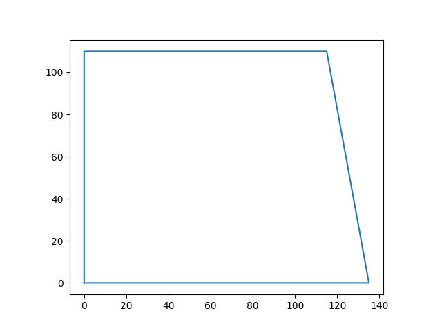 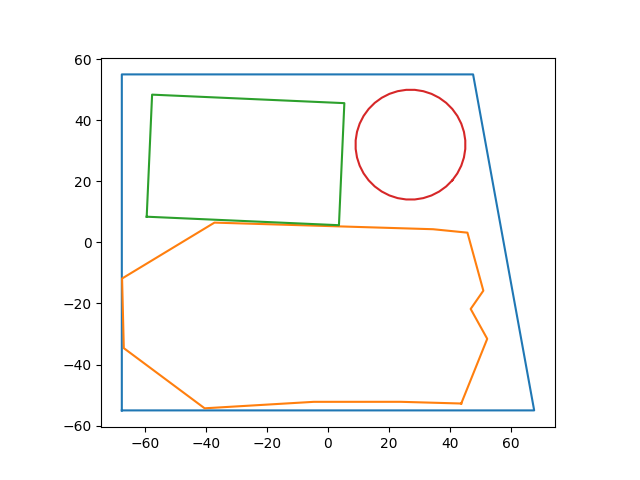 

 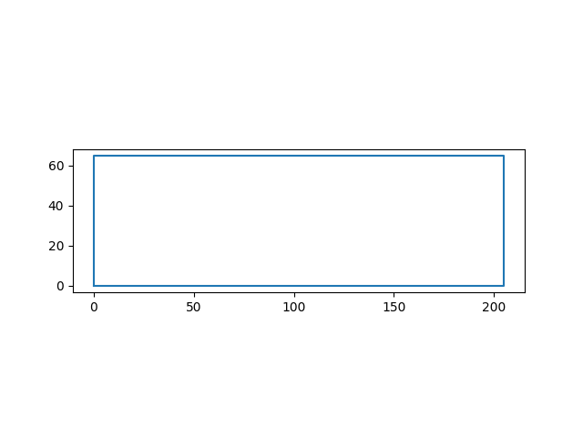 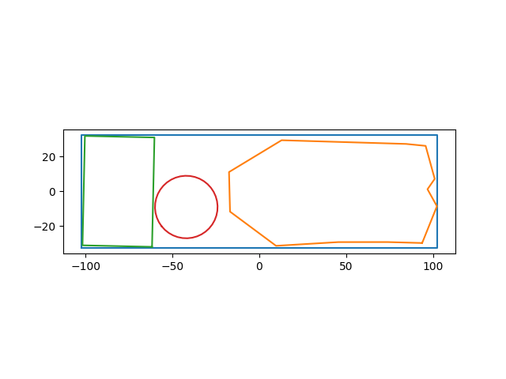 

 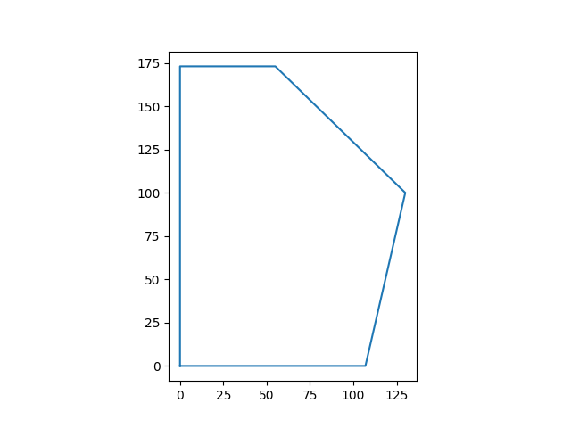 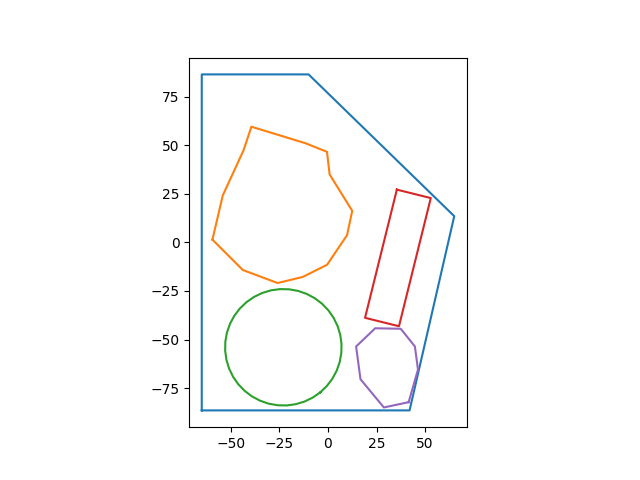 

  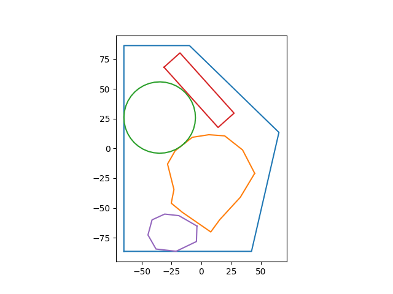 

 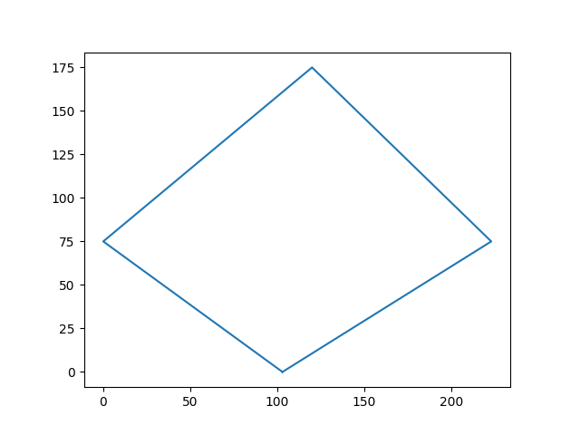 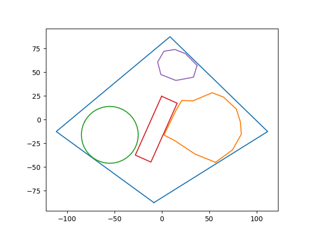 

  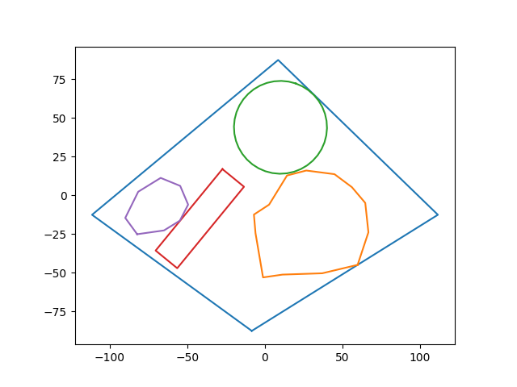 